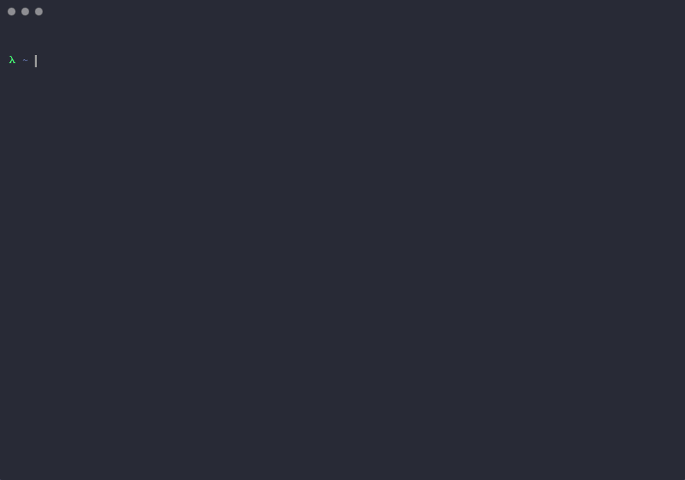

# jrnl

A quick and easy CLI journaling tool that uses Github Wiki repos for organizing journal entries.



* [Quick Start](#quick-start)
* [Requirements](#requirements)
* [Options](#options)
* [Generate Index](#index)
* [Append Images](#append-an-image)
* [Operate on a different date](#operate-on-a-different-date)

## Quick start

Install `jrnl`:

```bash
go get github.com/cjsaylor/jrnl
```

Clone a github wiki you want to act as the store of your journal:

```bash
git clone https://github.com/<yourname>/<journel_repo>.wiki.git ~/journal.wiki
```

Quickly drop into the editor of your choice (default `vim` but configurable via `$JRNL_EDITOR`):

```bash
jrnl
# or jrnl open
```

Write your entry and then "memorize":

```bash
jrnl memorize
```

## Requirements

* Git
* Github account (and access to a repo for the wiki)

## Options

You can configure `jrnl` with the following environment variables:

* `JRNL_EDITOR` (`vim`) - Editor to use
* `JRNL_EDITOR_OPTIONS` (`""`) - Additional CLI flags for your editor. IE, for VS Code: `-n $HOME/journal.wiki/`
* `JOURNAL_PATH` (`~/journal.wiki`) - Path to your cloned Github wiki repo.

## Index

`jrnl` has the ability to generate an `Index.md` that allows you to easily reference any journal entry by a tag.

In your journal entry, you can specify tags in `frontmatter` format:

> ~/journal.wiki/entries/2017-12-01.md
```
---
tags: [cooltag, another cool tag]
---

My journal content here
```

Then run the index command:

```bash
jrnl index
```

Which generates:

> ~/journal.wiki/Index.md

> * *cooltag* [2017-12-01]()
> * *another cool tag* [2017-12-01]()

If there is more than one journal entry that uses the same tag:

> ~/journal.wiki/Index.md

> * *cooltag* [2017-12-01](), [2017-12-04]()
> * *another cool tag* [2017-12-01]()

## Append an image

Many developers use hand-written notes (or a whiteboard) and want to store it in a common journal.

You can use the `jrnl image /path/to/image` command to quickly add an image to the journal repo and append it to the current journal entry.

## Operate on a different date

If you need to open or add an image to a different day's entry, you can use the `-date` flag:

```bash
jrnl -date 2017-12-05 open
```
